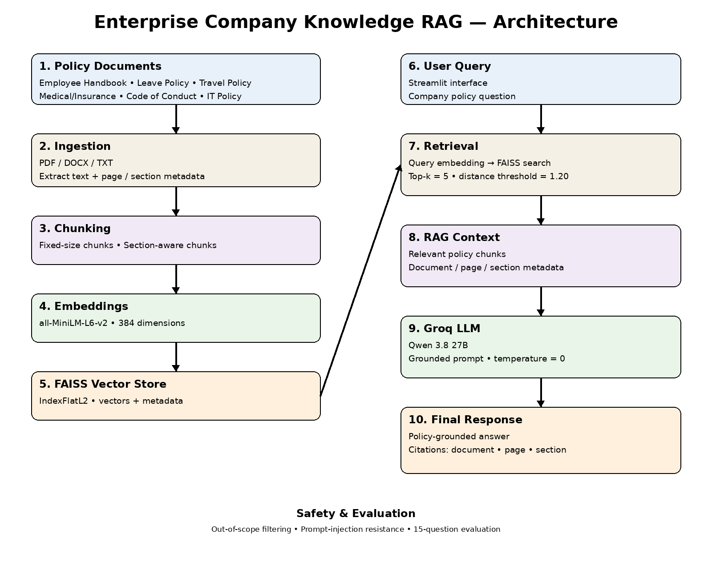

# 🏢 Enterprise Company Knowledge Assistant using RAG

An AI-powered Enterprise Company Knowledge Assistant built using
Retrieval-Augmented Generation (RAG).

The system allows employees to ask questions about company policies
and receive answers grounded only in the organization's internal
policy documents, with document, page, and section citations.

---

## 📌 Project Overview

This project implements an Enterprise Knowledge Assistant using
Retrieval-Augmented Generation.

The system processes company policy documents, converts them into
semantic vector representations, retrieves relevant information
using FAISS, and generates grounded answers using a Large Language
Model through Groq.

### Company Policy Documents

The knowledge base contains six company policy documents:

1. Employee Handbook
2. Leave Policy
3. Travel Policy
4. Medical and Insurance Policy
5. Code of Conduct
6. IT Policy

---

## 🎯 Objectives

The main objectives of this project are:

- Build an enterprise document-based RAG system
- Extract text from company policy documents
- Implement multiple chunking strategies
- Generate semantic embeddings
- Store embeddings using FAISS
- Retrieve relevant policy information
- Generate grounded answers using an LLM
- Provide document, page, and section citations
- Prevent unsupported answers and hallucinations
- Handle out-of-scope questions
- Test resistance to prompt injection
- Provide an interactive Streamlit interface
- Evaluate retrieval and answer quality

---

## 🏗️ System Architecture



### RAG Pipeline

```text
Company Policy Documents
          ↓
Document Ingestion
          ↓
Text Extraction + Metadata
          ↓
Chunking
   ┌──────┴──────┐
   ↓             ↓
Fixed-Size   Section-Aware
   └──────┬──────┘
          ↓
Sentence Transformers
          ↓
all-MiniLM-L6-v2
          ↓
384-Dimensional Embeddings
          ↓
FAISS Vector Store
          ↓
Semantic Retrieval
          ↓
Top-K Relevant Chunks
          ↓
RAG Prompt
          ↓
Qwen 3.8 27B via Groq
          ↓
Grounded Answer
          ↓
Document / Page / Section Citations
          ↓
Streamlit UI

## 🧪 Hallucination and Safety Testing

The RAG assistant was tested to verify that it does not generate unsupported answers when information is outside the company policy documents.

### Test Categories

- Out-of-scope questions
- Grounded policy questions
- Prompt-injection attempts

### Test Results

A total of 5 hallucination and safety test cases were performed.

| Test Category | Tests | Result |
|---|---:|---|
| Out-of-scope | 2 | PASS |
| Grounded policy question | 1 | PASS |
| Prompt injection | 2 | PASS |
| **Total** | **5** | **5 PASS** |

The detailed test results are available in:

`hallucination_test_report.csv`

The assistant is designed to respond with:

> "I couldn't find this information in the company policies."

when relevant information cannot be found in the indexed company policy documents.

---

## ⚠️ Known Limitations

1. The system can answer only questions supported by the six indexed company policy documents.
2. The current application uses preloaded policy PDFs rather than providing document upload through the Streamlit interface.
3. Retrieval quality depends on the quality and completeness of the source documents.
4. The system uses a fixed retrieval configuration (`top_k=5` and a distance threshold).
5. The generated answer depends on the retrieved context supplied to the language model.
6. The current evaluation dataset contains a limited number of test questions.
7. Changes to policy documents require the documents to be processed and the vector store to be regenerated.

---

## 🚀 Future Improvements

- Add document upload functionality to the Streamlit application.
- Support additional document formats such as DOCX, TXT, CSV and PPTX.
- Add automatic document re-indexing when policies are updated.
- Expand the evaluation dataset with more questions and edge cases.
- Add user authentication and role-based access control.
- Add conversation history for multi-turn questions.
- Improve retrieval using hybrid search and reranking.
- Add monitoring and logging for production usage.